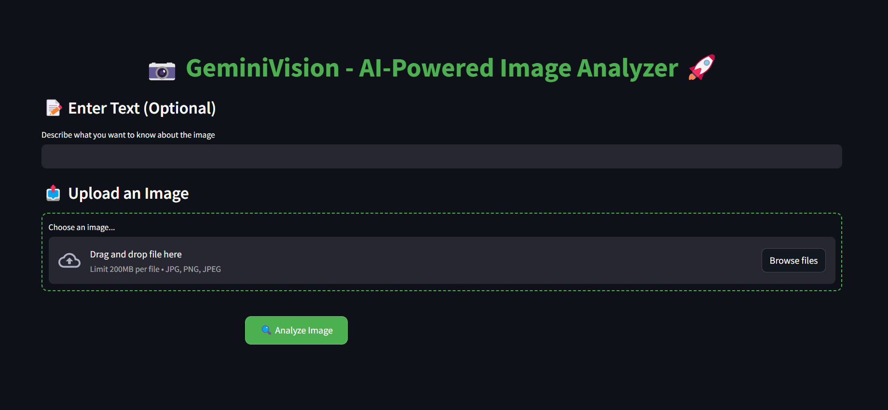

# 📷 Gemini Vision – AI-Powered Image Analyzer 

**Gemini Vision** is a **Streamlit-based AI application** that leverages **Google's Gemini AI** to analyze images and provide insightful responses.

---

## ✨ Features

✔ **Upload Images** (JPG, PNG, JPEG)\
✔ **Text Input Support** (Optional for additional context)\
✔ **AI-Powered Image Analysis** using **Google Gemini API**\
✔ **Modern & Responsive UI** (Styled with CSS)\
✔ **Error Handling** for missing API key or images

---

## 📌 Demo Screenshot



---

## 🚀 Installation & Setup

### 1️⃣ Clone the Repository

```sh
git clone https://github.com/yourusername/gemini-vision.git
cd gemini-vision
```

### 2️⃣ Create a Virtual Environment

```sh
python -m venv venv
source venv/bin/activate  # MacOS/Linux
venv\Scripts\activate      # Windows
```

### 3️⃣ Install Dependencies

```sh
pip install -r requirements.txt
```

### 4️⃣ Set Up API Key

Create a `.env` file in the project root and add your **Google API Key**:

```sh
GOOGLE_API_KEY=your_api_key_here
```

### 5️⃣ Run the Application

```sh
streamlit run app.py
```

---

## 🛠 Technologies Used

- **Python** 🐍
- **Streamlit** 🎨 (For UI)
- **Google Gemini AI API** 🤖
- **PIL (Pillow)** 🖼 (For image processing)

---

## 📜 License

This project is licensed under the **MIT License**. Feel free to modify and use it!

---

## 🤝 Contributing

Contributions are welcome! If you'd like to improve **Gemini Vision**, follow these steps:

1. **Fork the repository**
2. **Create a new branch** (`feature-new`)
3. **Commit your changes**
4. **Push and submit a Pull Request** 🚀

---

## 📩 Contact

📧 **Email:** [akarshvante@gmail.com](mailto\:akarshvante@gmail.com)\
🐙 **GitHub:** [AkarshVante](https://github.com/AkarshVante)\
**Live:** [My app](https://geminivisionai.streamlit.app)
